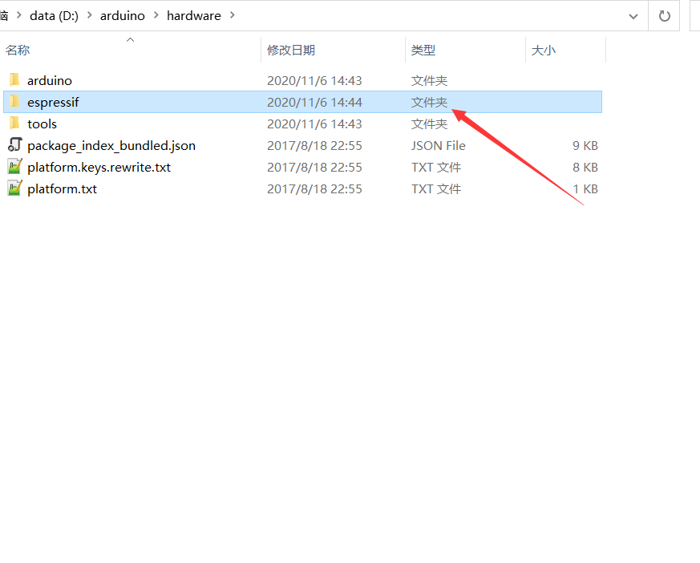

Arduino开发环境搭建(ESP32)
**************************

（1） **下载Arduino**

	点击 `这里下载`_. （提取码：qsfa ），打开下载安装包，点击 I Agree

.. _这里下载: https://pan.baidu.com/s/17sgMOiVirZBIeG14MotDBA 

.. figure:: ../../_static/arduino/1.png
    :align: center
    :figclass: align-center

（2） **点击Next**

.. figure:: ../../_static/arduino/2.png
    :align: center
    :figclass: align-center

（3） **默认是安装在c盘，可以点击Browse更改安装位置**

.. figure:: ../../_static/arduino/3.png
    :align: center
    :figclass: align-center

（4） **这里我安装在d盘的arduino文件夹下（记住这个安装路径）**

.. figure:: ../../_static/arduino/4.png
    :align: center
    :figclass: align-center

（5） **等待安装完成，打开安装路径下的hardware**

.. figure:: ../../_static/arduino/5.png
    :align: center
    :figclass: align-center

（6） **点击下方链接下载sdk**
	 `下载sdk`_. （提取码：8ita），下载完成解压到hardware目录下
 

.. _下载sdk: https://pan.baidu.com/s/1BXT0BUuBzCrGQT9FAb5qXw

（7） **打开ArduinoIDE，选择对应的开发板**

.. figure:: ../../_static/arduino/15.png
    :align: center
    :figclass: align-center

（8） **连接开发板，选择开发板对应的串口，确认开发板相关配置**

.. figure:: ../../_static/arduino/16.png
    :align: center
    :figclass: align-center

