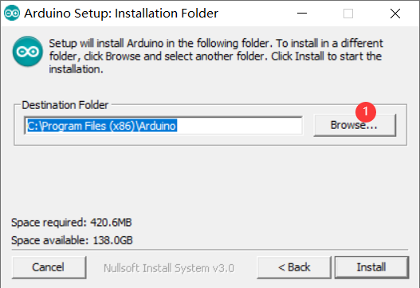
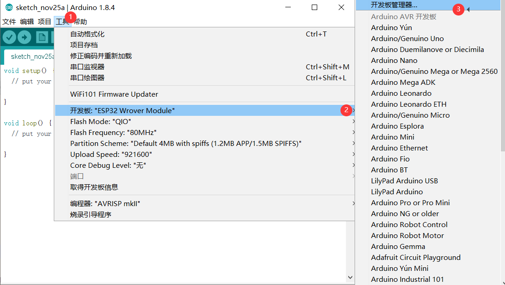

Arduino开发环境搭建(ESP8266)
****************************

**在电脑上安装Arduino、Git和python等工具，安装软件部分就不再过多阐述。**

（1）在Arduino官网下载安装arduinoIDE，打开下载安装包，点击 I Agree

.. figure:: ../../_static/arduino/1.png
    :align: center
    :figclass: align-center

（2）点击Next

.. figure:: ../../_static/arduino/2.png
    :align: center
    :figclass: align-center

（3）默认是安装在c盘，可以点击Browse更改安装位置。

（4）这里我安装在d盘的arduino文件夹下（记住这个安装路径）

.. figure:: ../../_static/arduino/4.png
    :align: center
    :figclass: align-center

（5）启动Arduino并打开“首选项”窗口。

.. figure:: ../../_static/arduino/8266/1.png
    :align: center
    :figclass: align-center
	

（6）添加 https://arduino.esp8266.com/stable/package_esp8266com_index.json 到附加董事会经理的URL字段。您可以添加多个URL，并用逗号分隔。

.. figure:: ../../_static/arduino/8266/2.png
    :align: center
    :figclass: align-center

（7）进入开发板管理器

（8）从工具>主板菜单打开“开发板管理器”并找到esp8266 平台。从下拉框中选择所需的版本。
单击安装按钮。(服务器在国外，会有点慢)

.. figure:: ../../_static/arduino/8266/4.png
    :align: center
    :figclass: align-center

（9）安装后，从“工具”>“主板”菜单中选择ESP8266主板。

