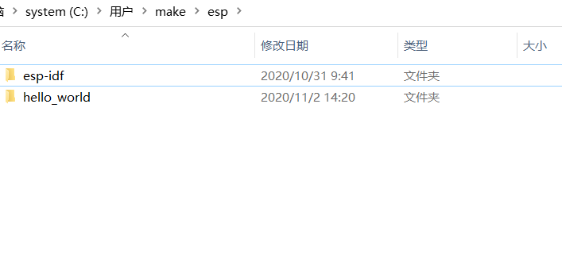
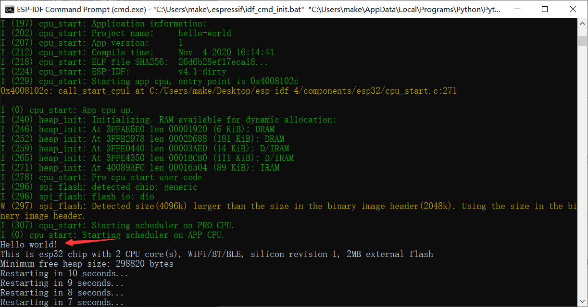

ESP-IDF开发环境搭建(ESP32)
**************************

Windows 平台工具链的标准设置
----------------------------

ESP-IDF 需要安装一些必备工具，才能围绕 ESP32 构建固件，包括 Python、Git、交叉编译器、
menuconfig 工具、CMake和 Ninja 编译工具等。

有两个方法，一个是 ESP-IDF 工具安装器，另一个是使用命令提示符
这里我们介绍一下ESP-IDF 工具安装器

1.ESP-IDF 工具安装器
--------------------
要安装 ESP-IDF 必备工具，最简易的方式是下载 ESP-IDF 工具安装器，地址如下：
https://dl.espressif.com/dl/esp-idf-tools-setup-2.3.exe

本安装器可为您安装所需的交叉编译器、OpenOCD、cmake 和 Ninja 编译工具，以及一款 mconf-idf 配置工具。此外，本安装器还可在有需要时下载、运行 Python 3.7 和 Git For Windows 的安装器。
本安装器还可用于下载任意 ESP-IDF 发布版本。推荐将 ESP-IDF 下载到 %userprofile%\esp 目录下，其中 %userprofile% 代表家目录。可运行以下命令，创建 %userprofile%\esp。
mkdir %userprofile%\esp

ESP-IDF 工具安装器可在“开始”菜单中，创建一个打开 ESP-IDF 命令提示符窗口的快捷方式。本快捷方式可以打开 Windows 命令提示符（即 cmd.exe），并运行 export.bat 脚本以设置各环境变量（比如 PATH，IDF_PATH 等）。此外，您可还以通过 Windows 命令提示符使用各种已经安装的工具。
注意，本快捷方式仅适用 ESP-IDF 工具安装器中指定的 ESP-IDF 路径。如果您的电脑上存在多个 ESP-IDF（比如您需要不同的 ESP-IDF 版本）需要使用快捷方式，您可以：
为 ESP-IDF 工具安装器创建的快捷方式创建一个副本，并将新快捷方式的“当前路径”指定为您希望使用的 ESP-IDF 路径。
运行 cmd.exe，并更新至您希望使用的 ESP-IDF 目录，然后运行 export.bat。注意，这种方法要求 PATH 中存在 Python 和 Git。如果您在使用时遇到有关“找不到 Python 或 Git” 的错误信息，请使用第一种方法。

当 ESP-IDF 工具安装器安装完成后，则开发环境设置也到此结束。

.. attention::

	如果工具安装器安装未能安装成功，也可以通过 “命令提示符” 窗口手动安装这些工具

	1.获取ESP-IDF，打开“命令提示符”，命令行依次输入一下命令：::
	
		mkdir -p ~/esp
		cd ~/esp
		git clone --recursive https://github.com/espressif/esp-idf.git
		
	2.设置工具，命令行输入：::
	
		cd %userprofile%\esp\esp-idf\install.bat

	3.等待设置工具完成后，设置环境变量，命令行输入：::
	
		cd %userprofile%\esp\esp-idf\export.bat
		
	**注意：每次打开新的“命令提示符”都需要设置环境变量**

2.开始创建工程
--------------
现在，您可以开始准备开发 ESP32 应用程序了。您可以从 ESP-IDF 中 examples 目录下的 get-started/hello_world 工程开始。
将 get-started/hello_world 复制至您本地的 ~/esp 目录下：

cd %userprofile%\esp
xcopy /e /i %IDF_PATH%\examples\get-started\hello_world hello_world

可以查看目录下有一个hello_world文件夹

ESP-IDF 的 examples 目录下有一系列示例工程，都可以按照上面的方法进行创建。您可以按照上述方法复制并运行其中的任何示例，也可以直接编译示例，无需进行复制。

3.连接设备
----------

现在，请将您的 ESP32 开发板连接到 PC，并查看开发板使用的串口。
通常，串口在不同操作系统下显示的名称有所不同：

打开“设备管理器，查看端口

.. figure:: ../../_static/esp-idf/2.png
    :align: center
    :figclass: align-center

COM18是此电脑的端口

4.配置
------
在命令行输入
cd %userprofile%\esp\hello_world

idf.py menuconfig
如果之前的步骤都正确，则会显示下面的菜单：

.. figure:: ../../_static/esp-idf/3.png
    :align: center
    :figclass: align-center

``menuconfig`` 工具的常见操作见下。

* 上下箭头：移动
* ``回车``：进入子菜单
* ``ESC 键``：返回上级菜单或退出
* ``英文问号``：调出帮助菜单（退出帮助菜单，请按回车键）。
* ``空格``或 ``Y 键``：选择 ``[*]`` 配置选项；``N 键``：禁用 ``[*]`` 配置选项
* ``英文问号`` （查询配置选项）：调出有关该选项的帮助菜单
* ``/ 键``：寻找配置工程

5.编译工程
----------

使用以下命令，编译烧录工程：:
idf.py build

.. figure:: ../../_static/esp-idf/4.png
    :align: center
    :figclass: align-center

6.烧录到设备
------------
使用以下命令，将刚刚生成的二进制文件烧录 (bootloader.bin, partition-table.bin 和 hello-world.bin) 至您的 ESP32 开发板：
idf.py -p PORT [-b BAUD] flash
请将 PORT 替换为 ESP32 开发板的串口名称。此电脑之前查看的端口是COM18就是 idf.py -p COM18 flash

.. figure:: ../../_static/esp-idf/5.png
    :align: center
    :figclass: align-center

您还可以将 BAUD 替换为您希望的烧录波特率。默认波特率为 460800。

7.监视器
--------
您可以使用 idf.py -p PORT monitor 命令，监视 “hello_world” 的运行情况。
注意，不要忘记将 PORT 替换为您的串口名称。我这里是 idf.py -p COM18 monitor

.. figure:: ../../_static/esp-idf/6.png
    :align: center
    :figclass: align-center

输出结果如下图

您可使用快捷键 Ctrl+]，退出 IDF 监视器

您也可以运行以下命令，一次性执行构建、烧录和监视过程：
idf.py -p PORT flash monitor

**本章内容是参考ESP-IDF 编程指南中快速入门章节，如有需要可以查看https://docs.espressif.com/projects/esp-idf/zh_CN/latest/esp32/get-started/index.html**

